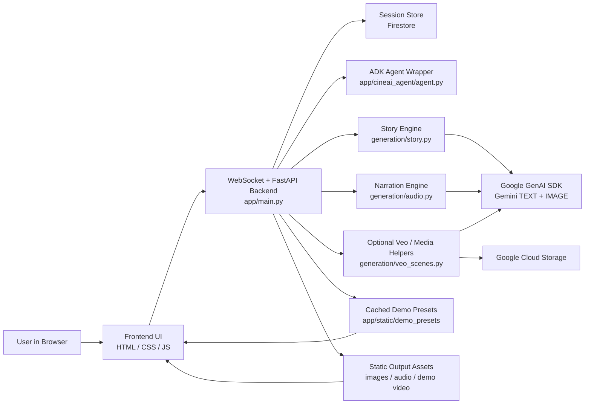

# CineAI — File Upload Architecture Diagram

This file is intended to be used as the standalone architecture artifact for submission.

## System Diagram

## High-Level Architecture

### 1. Frontend

The browser UI collects the five story beats:

- `Who`
- `World`
- `Sound / Mood`
- `Change`
- `Ending`

The frontend sends those beats to the backend over a WebSocket connection and renders:

- chat progress
- story images
- narration audio
- cached demo video playback for presets

Primary frontend files:

- [app/static/index.html](app/static/index.html)
- [app/static/js/app.js](app/static/js/app.js)
- [app/static/css/style.css](app/static/css/style.css)

### 2. Backend Orchestrator

FastAPI in [app/main.py](app/main.py) coordinates the app:

- accepts the five story answers
- decides whether the session is a `custom story` or a `preset demo`
- routes custom stories into the image-led story engine
- serves preset demo playback instantly when a preset is chosen
- streams scene and audio events back to the frontend

### 3. Story Generation

The core storytelling engine lives in [generation/story.py](generation/story.py).

For custom stories, it:

- builds a cinematic prompt from the five story beats
- calls Gemini through the Google GenAI SDK
- requests mixed `TEXT + IMAGE` output
- parses the returned narration and images into a six-scene visual story

This is the main Gemini-native creative storytelling path.

### 4. Session State

Session state is managed in [app/cineai_agent/agent.py](app/cineai_agent/agent.py).

The app uses:

- `google.cloud.firestore`
- `firestore.Client(...)`

Firestore is used to persist session progress and generated-asset state when available, with local memory fallback during local development.

### 5. Google Services Used

#### Gemini / Google GenAI SDK

Used for:

- image-led story generation
- narration-related model calls
- optional media helpers

Primary code:

- [generation/story.py](generation/story.py)
- [generation/audio.py](generation/audio.py)

#### Firestore

Used for:

- session state persistence
- story-progress recovery

Primary code:

- [app/cineai_agent/agent.py](app/cineai_agent/agent.py)

#### Vertex AI / Google Cloud Auth Helpers

Used in helper infrastructure for:

- Vertex model routing
- regional image-generation configuration
- Google Cloud authentication refresh

Primary code:

- [generation/vertex.py](generation/vertex.py)

#### Google Cloud Storage

Used in media helper code for:

- fetching GCS-backed generated video/media assets

Primary code:

- [generation/veo_scenes.py](generation/veo_scenes.py)

### 6. Preset Demo Path

To ensure a stable demo experience, CineAI includes cached presets under:

- [app/static/demo_presets](app/static/demo_presets)

When a preset such as `The Father's Sacrifice` is selected:

- the backend skips live generation
- loads the pre-rendered demo assets
- sends the demo film directly to the frontend

This guarantees a reliable showcase even if live model quota is limited.

### 7. Current Runtime Paths

#### Custom Story Path

1. user answers five questions
2. FastAPI stores the answers in session state
3. backend calls the story engine
4. Gemini returns narration + images
5. frontend renders a cinematic image-led story
6. narration audio is attached if available

#### Preset Demo Path

1. user clicks a preset
2. backend loads cached preset assets
3. frontend switches to direct demo playback

## Service Map

| Layer | Service / Tech | Purpose |
|---|---|---|
| Frontend | Browser + JS UI | Collect story beats and render output |
| Backend | FastAPI + WebSocket | Coordinate story sessions and streaming |
| Agent | Google ADK | Agent/session wrapper |
| GenAI | Google GenAI SDK | Gemini generation calls |
| State | Firestore | Session persistence |
| Media Storage | Google Cloud Storage | Optional generated asset retrieval |
| Demo Assets | Local static preset cache | Stable demo playback |

## Submission Note

For Devpost:

- upload a screenshot/export of this diagram as the architecture image
- or link directly to this file in the GitHub repo as the architecture artifact
