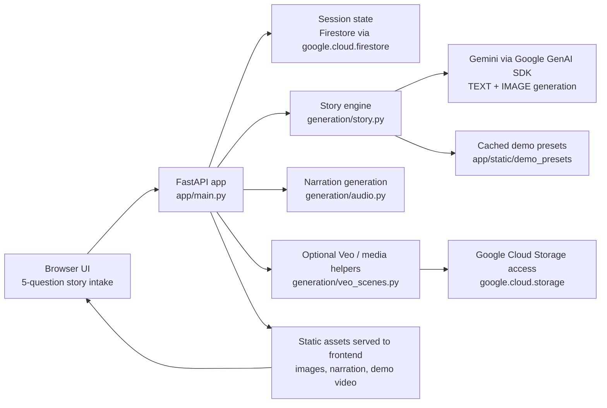

# CineAI

CineAI is a cinematic storytelling app for the Gemini Live Agent Challenge.

Current flow:
- ask 5 questions: `Who -> World -> Sound / Mood -> Change -> Ending`
- for custom stories, show an image-led visual story with narration
- for preset demos, play a cached demo cut instantly

## Run Locally

```bash
pip install -r requirements.txt
python3 -m uvicorn app.main:app --host 127.0.0.1 --port 8080
```

Open:

```text
http://127.0.0.1:8080
```

## Architecture Diagram

Upload a screenshot or export of the diagram below to the Devpost image gallery or file upload as the required architecture diagram.



At a high level:
- the browser collects the five story beats
- FastAPI orchestrates the story flow
- Firestore can persist session state
- Gemini generates the story content
- cached demo assets provide a reliable fallback path
- optional narration/media helpers prepare playback assets for the frontend

## Reproducible Testing

### Option A: No-API Demo Test

This is the most reliable judge path.

1. Start the server:

```bash
python3 -m uvicorn app.main:app --host 127.0.0.1 --port 8080
```

2. Open the app in a browser.
3. Click the preset `The Father's Sacrifice`.

Expected result:
- the preset loads immediately
- the right panel switches to video mode
- the demo film is playable

### Option B: Custom Story Test

1. Export a valid Gemini key:

```bash
export GEMINI_API_KEY="YOUR_KEY_HERE"
```

2. Start the server:

```bash
python3 -m uvicorn app.main:app --host 127.0.0.1 --port 8080
```

3. Answer the five prompts with this sample:

- `Who`: `My grandmother who taught me to make bread`
- `World`: `A small warm kitchen at sunrise`
- `Sound / Mood`: `Quiet, tender, flour in the air, soft morning light`
- `Change`: `The last morning we baked together, her hands were shaking`
- `Ending`: `Flour on my hands still feels like her blessing`

Expected result:
- the app advances through all five questions
- after the fifth answer, the custom image-story path starts
- the right panel presents a cinematic image-led story
- narration text appears with the images
- narration audio appears if TTS succeeds

If model quota is unavailable, use the preset demo path above for evaluation.

## Google Cloud / Google API Usage Proof

Judges can verify Google services and APIs directly in the repo:

- Google GenAI SDK story generation:
  - [generation/story.py#L216-L242](generation/story.py#L216-L242)
  - Uses `google.genai` and `client.models.generate_content(...)` with `TEXT + IMAGE` output.

- Firestore session state on Google Cloud:
  - [app/cineai_agent/agent.py#L20-L39](app/cineai_agent/agent.py#L20-L39)
  - [app/cineai_agent/agent.py#L53-L89](app/cineai_agent/agent.py#L53-L89)
  - Uses `google.cloud.firestore` and `firestore.Client(...)` for session persistence.

- Vertex AI configuration and Cloud auth:
  - [generation/vertex.py#L10-L15](generation/vertex.py#L10-L15)
  - [generation/vertex.py#L135-L154](generation/vertex.py#L135-L154)
  - Includes `cloud-platform` scope, Vertex region routing, `vertexai=True`, and ADC-based Google auth refresh.

- Google Cloud Storage handling for generated media:
  - [generation/veo_scenes.py#L14-L15](generation/veo_scenes.py#L14-L15)
  - [generation/veo_scenes.py#L88-L94](generation/veo_scenes.py#L88-L94)
  - Uses `google.cloud.storage` and `storage.Client()` to fetch GCS-backed video assets.

- GCP project/location configuration:
  - [config/settings.py#L17-L33](config/settings.py#L17-L33)
  - Shows the app’s Google Cloud project, location, Firestore, GCS, Gemini, and Veo settings.

## Minimal Checks

```bash
python3 -m pytest tests/test_story.py tests/test_extraction.py
```
